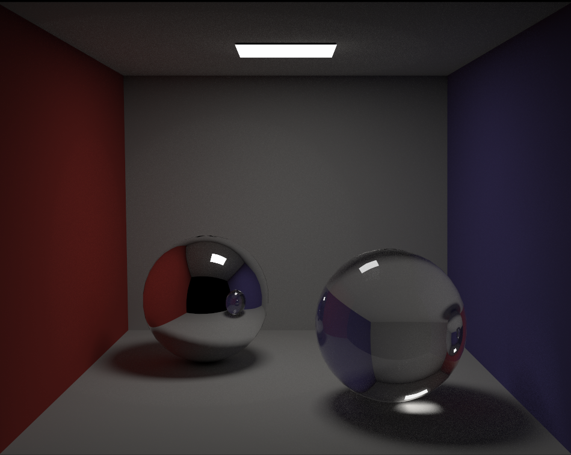
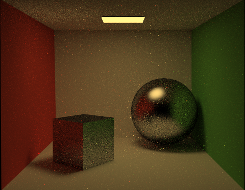
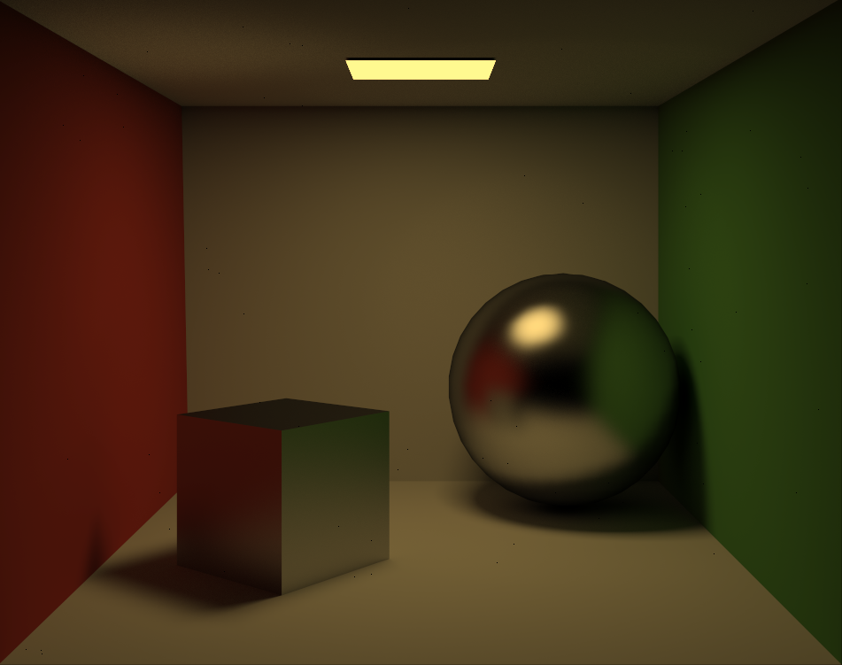
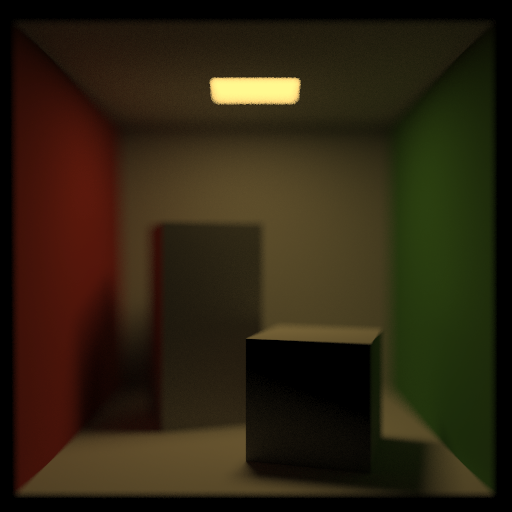
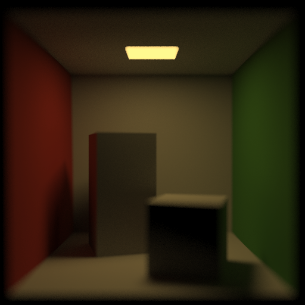

# Path Tracer

This is my implementation of a physically-based renderer using path tracing, which has core functionalities such as global illumination, event splitting, Russian roulette termination, soft shadows, tone mapping, and four BRDFs (diffuse, specular, glossy, refractive). It additionally supports importance sampling, stratified sampling, and depth-of-field effects.



See [outputs/](./outputs) for examples of rendered images.

## Features
The core path tracing algorithm can be found in pathtracer.cpp. The following features are supported by the path tracer:

* **Indirect illumination**: By default, the renderer samples paths uniformly from the hemisphere at each intersection point. A recursive ray is cast to estimate the incoming radiance to the intersection. Doing this provides a single-sample Monte Carlo estimate of the rendering equation per path traced from the camera.
* **Direct illumination** & event splitting: To reduce the variance of naive indirect lighting, the domain of the rendering equation integral $(\int_{\mathcal{H}^2} f_r \cdot L_i \cdot \cos{\theta_i} \, d\omega_i)$ is split into two mutually exclusive regions: one for rays that intersect light sources and the other for rays that don't (i.e. direct and indirect lighting). This is done by directly casting rays toward light sources when appropriate and weighting the contribution of direct/indirect radiance. If the light is occluded by other geometry in the scene, then the lighting contribution is not counted.
* **Soft shadows**: When generating shadow rays from a surface point, several random points are sampled, each from a randomly chosen area light source. Since the light sources are represented as emissive triangles, I used barycentric coodinates to sample points on the lights. This random light point sampling provides soft shadows.
* **Russian roulette path termination**: To achieve an unbiased estiamtor of the rendering equation, I terminated paths randomly with a fixed probability (0.2) at each intersection event. This probability is also accounted for in the MC estimator.
* **Tone mapping + gamma correction**: I used the extended Reinhard tonemap operator to map the renderer's high dynamic range radiance values to a 0-255 RGB color space. The tonemap operator acts on luminance values calculated by weighting the RGB channels of the radiance. Additionally, I used basic gamma correction to help make darker regions of the renderings more visible. 
* **BRDFs**: The path tracer can render diffuse, mirror, glossy/phong, and refractive surfaces. Refractive surfaces like glass cast transmitted rays into the object according to Snell's law. Additionally, Fresnel reflection is estimated using Schlick's approximation; the radiance contribution from reflected/transmitted rays is weighted accordingly such that the reflectance is greatest at grazing angles.
* **BRDF importance sampling**: To reduce the variance caused by naive uniform hemisphere sampling, I also implemented BRDF-based importance sampling for diffuse and glossy BRDFs, which can be optionally enabled in util/CS123Common.h. Rather than sampling uniformly, rays are sampled according to a probability distribution roughly proportional to the BRDF at the intersection. For diffuse surfaces, the PDF is proportional to the cosine of the angle between the surface normal and sampled ray. For glossy surfaces, it is proportional to the $cos^n(\phi)$ term of the Phong BRDF, which spikes near the mirror-reflected direction. I derived the random ray samplers for these distributions by applying the inversion method (by first computing the PDF w.r.t. the ray direction, then the CDF, then the inverse of the CDF). 

   
   
   
* **Stratified sampling**: To further reduce the total radiance, I implemented stratified subpixel sampling which can be optionally enabled. Rather than randomly sampling rays from the camera through random locations within each pixel, pixels are subdivided into smaller cells, and one sample is picked within each cell. Doing so decreases the discrepancy by making it impossible for samples to cluster in the same (few) regions; the samples become more regularly spaced but still remain random.
    * The effect of stratified sampling is quite difficult to discern visually; e.g. there is very slight noise reduction in the soft shadows.
* **Depth of field**: I simulated depth of field by randomly scattering the origin of camera rays across a smallcircular lens instead of always casting rays from a fixed camera point. This produces an effect that mimics camera defocus blur. The location of the focus plane can be increased as an option, which will result in farther objects in the scene being in focus.

   
   


## Running the code
First clone the repo via SSH. In the root directory, run

```
git submodule update --init --recursive
```

Before running the code, first edit the rendering options at the top of util/CS123Common.h. See the inline comments for a description of each. The additional features can be enabled in any combination. 

Build the program using Qt and set the working directory to be the root of this repo. Run the program by providing two space-separated command line arguments: a relative path to the input XML scenegraph and a relative path to the desired output file. For example, the arguments could be ```example-scenes/CornellBox-Glossy.xml outputs/CornellBox-Glossy.png```
